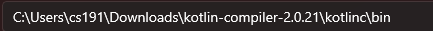

<h1>Aplicação de Consultas Médicas 🎉️ </h1>

    Uma aplicação para cadastrar consultas médicas provendo a melhor
    interação entre médico e paciente, dando liberdade para escolher, quando e
    quem fara a consulta. 😃

<h2>Como fazer inicialização da aplicação</h2>

    Para iniciar a aplicação e ter total experiência bastar seguir os seguintes passos.
<ul>
<li>Primeiro você deve garantir ter o compilador do Kotlin para assim conseguir criar o back-end da aplicação, baixe Kotlin compiler <a href="https://github.com/JetBrains/kotlin/releases/tag/v2.0.21">Aqui</a> (baixar a versão .zip).
<li>Extraia a pasta do kotlin vá ate o diretório da basta bin do Kotlin compiler e adicione ele nas suas variáveis de ambiente do sistema PATH</li>
 o caminho deve ser algo parecido com isso.
<li>Instale também o Apache Maven <a href="https://maven.apache.org/download.cgi">aqui</a> (também é a versão .zip), e repita o processo de adicionar o caminho da pasta bin
na variavel de ambiente do sistema PATH.</li>
<li>Caso não tenha Node.js na sua máquina instale ele <a href="https://nodejs.org/pt">aqui</a>.</li>
<li>Após esses passos a sua máquina está pronta para rodar a aplicação, faça o ‘download’ dos aquivos do sistema nesse github, ao entrar na raiz do diretório (basta clicar com botão direito na pasta agenda_de_consultas) execute <strong>npm i</strong> ou <strong>npm install</strong>.</li>
<li>Execute <strong>npm update -g</strong> para garantir estar nas últimas versões dos pacotes utilizados.</li>
<li>Execute <strong>npm start</strong> assim todos os comandos serão iniciados e a aplicação iniciada</li>
</ul>
<h2> Caso de erro na porta que você está a tentar acessar</h2>

Caso dê erro na aplicação por conflito de rota você pode estar a acessar o aquivo <strong>application.properties</strong> seguindo o caminho "backend/demo/src/main/resources" onde nesse
arquivo irá constar 2 variáveis de ambiente, sendo uma dela a variável que define em qual porta o back end rodará em caso de problema você poderá alterar para qual poerta deseja usar

----------------------

No caso do Node.js no aquivo <strong>server.js</strong> terá uma variável <strong>port</strong> onde vc pode estar mudando para se adequar a sua porta disponível

----------------------

 Como a aplicação pega a seu endereço ip para criar uma rota em que qualquer dispositivo possa acessar é preciso garantir que o backend aceite requisições vindas dessa url,
nesse caso é preciso fazer algumas alterações em código, vá até "backend/demo/src/main/kotlin/MyApiController" nele você irá adicionar a rota que o express está gerando nesse trecho de código "@CrossOrigin(origins = ["http://192.168.1.151:8080", "adicione aqui sua rota do frontend"]) // Permite requisições de 'http://192.168.1.151:8080' para todos os endpoints deste controller", você pode obter essa rota
indo ate o seu terminal e verificando qual rota o express criou para você ex: Servidor rodando: http://192.168.1.151:8080.

----------------------

 Lembrando de verificar também as funções <strong>fetch</strong> do javascript caso você altere a porta do backend já que elas irão precisar dela.

<h1> Acessar o Site</h1>

 Você pode estar a acessar o site estático <a href="#">Neste Link</a>

